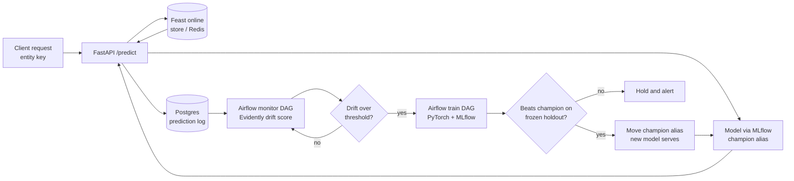

# Drift Sentinel

**A fraud-detection model that monitors itself, retrains when the world shifts under it, and refuses to
promote a worse model, without a human in the loop.**

A PyTorch classifier is served by FastAPI, enriched from a Feast online store, and versioned in an
MLflow registry. Every prediction is logged, and Evidently continuously measures how far live traffic
has drifted from a fixed reference. That drift score is a Prometheus metric wired straight to an action:
when it crosses a threshold, Airflow fires a retrain, MLflow logs the challenger, and an automated gate
compares it to the reigning champion on a frozen holdout. Win, and the new model starts serving traffic
through a single registry write, no redeploy. Lose, and the pipeline holds and alerts. The full loop,
serving, feature store, drift detection, orchestration, training, and promotion, runs on one machine in
`docker-compose` at zero cloud cost.

Ten integrated systems (PyTorch, FastAPI, Feast, Redis, Postgres, MLflow, Evidently, Prometheus,
Grafana, Airflow) wired into one closed feedback loop.

> ### 🚧 Work in progress
>
> The pitch above describes the finished design; the repo is being **built in phases and is not there
> yet.** The infrastructure layer (Postgres, Redis, MLflow, Airflow) is up, and Phase 0 (the frozen
> holdout, its versioning, and CI) is landing. The serving, monitoring, and training loop above it does
> not exist yet. Per a house rule, nothing here is presented as a measured result until the system is
> instrumented and has produced real numbers. See [Status](#status) for what actually works today.

## What it will be

The thesis is one line: **observability is a trigger, not a dashboard.** Most monitoring setups draw a
drift chart and rely on a human to notice it. This project wires the drift score directly to an action:
when it crosses a threshold, retraining fires automatically, and an automated gate decides whether the
result is allowed to serve traffic.

The end state is a closed loop:



Three deliberately decoupled paths:

1. **Serving (always on):** a request carries an *entity key*, not features. The server fetches that
   entity's features from the Feast online store, loads whatever model version the MLflow `champion`
   alias points at, responds, and logs the features and prediction to Postgres.
2. **Monitoring (hourly, cheap):** an Airflow DAG uses Evidently to compare a recent window of logged
   predictions against the frozen reference window, computing data drift and prediction drift
   separately. The score is exported to Prometheus and charted in Grafana. A threshold breach fires the
   trigger.
3. **Training (rare, expensive):** the breach triggers a second Airflow DAG that pulls a
   point-in-time-correct training frame from the Feast offline store, trains a PyTorch model with early
   stopping, logs everything to MLflow, and promotes the challenger only if it beats the champion on the
   frozen holdout.

## Why it exists (and how it differs from `retrain-pipeline`)

This is project four of a four-repo portfolio (`rag-api`, `inference-gateway`, `retrain-pipeline`,
`drift-sentinel`), and the deliberate Python and PyTorch anchor among three Go services.

The distinction from `retrain-pipeline` is the point. That repo is **code and schedule triggered with a
human governance gate**. This one is **evidence-triggered with an automated metric gate**, and it adds
the feature-store and live-monitoring stages the portfolio otherwise lacks. The reasoning is recorded
in [ADR 0001](docs/adr/0001-evidence-triggered-continuous-training.md).

## Tech stack

| Concern | Tool |
|---|---|
| Model | PyTorch (tabular MLP, CPU) |
| Serving | FastAPI |
| Feature store | Feast (Redis online, Parquet offline) |
| Experiment tracking + registry | MLflow (aliases as the control plane) |
| Drift detection | Evidently |
| Observability | Prometheus + Grafana |
| Orchestration | Apache Airflow (LocalExecutor) |
| Storage | Postgres, Redis |
| Packaging | docker-compose |

## Status

Built in phases; **Phase 5 is the MVP cut line**, when the closed loop runs end to end.

- **Phase 0 (in progress):** frozen holdout carved, content-hashed, and enforced by tests; CI; this
  README. See [ADR 0002](docs/adr/0002-holdout-versioning-by-content-hash.md) for how the holdout is
  versioned.
- **Phase 1:** Feast entities, feature views, offline and online stores.
- **Phase 2:** PyTorch training, MLflow tracking, promotion gate on the frozen holdout.
- **Phase 3:** FastAPI serving with online feature enrichment and prediction logging.
- **Phase 4:** Evidently drift scoring exported to Prometheus, charted in Grafana.
- **Phase 5:** the Airflow monitor and train DAGs that close the loop.

Explicitly out of scope for the MVP: Kubernetes, Kafka or streaming ingestion, feature-drift
attribution, canary or shadow deploys, and cloud deploy (an optional later phase).

## Cost and guardrails

**The MVP costs roughly $0 to build and run.** Every component (Airflow, MLflow, Feast, Redis,
Postgres, Prometheus, Grafana, and the FastAPI server) runs locally in `docker-compose`. The dataset
is public. The tabular MLP trains on CPU in seconds, so there is no GPU, no GPU quota, and no cloud
bill in the MVP. The only local cost is disk and memory.

No billable cloud resources exist in this repo today. The guardrails apply if and when the optional
cloud deploy (Phase 7) happens:

- Infrastructure is Terraform up and down, so a session leaves nothing running.
- Billable resources are torn down after each session (`terraform destroy`).
- A budget alarm goes up before any cloud spend, as a habit carried over from the Go repos.

The single-region ECS deploy sketched for Phase 7 costs pennies per session and is never left up.

## Local setup

`.env` is required and gitignored, so Airflow's bind-mounted directories are owned by your user:

```bash
echo "AIRFLOW_UID=$(id -u)" > .env
```

Then bring up the stack:

```bash
docker compose up -d      # start Postgres, Redis, MLflow, and Airflow
docker compose ps         # status and health of each service
```

MLflow UI on `:5000`, Airflow UI on `:8080` (`admin`/`admin`).

## Commands

```bash
# Frozen holdout: carve, hash, and write the manifest (needs the raw dataset in data/)
python scripts/carve_holdout.py

# Tests: hermetic carve-logic tests always run; the real-data seal test runs when the holdout exists
pytest -v

# Compose lifecycle
docker compose up -d          # start all services
docker compose down           # stop; named volumes survive
docker compose down -v        # stop and DELETE volumes (wipes the registry and all runs)
```

## Architecture decisions

Decisions with lasting consequences are recorded in [`docs/adr/`](docs/adr/):

- [ADR 0001: Evidence-triggered continuous training on docker-compose](docs/adr/0001-evidence-triggered-continuous-training.md)
- [ADR 0002: Version the frozen holdout by content hash, not DVC](docs/adr/0002-holdout-versioning-by-content-hash.md)
